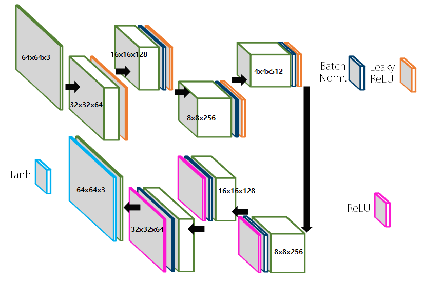
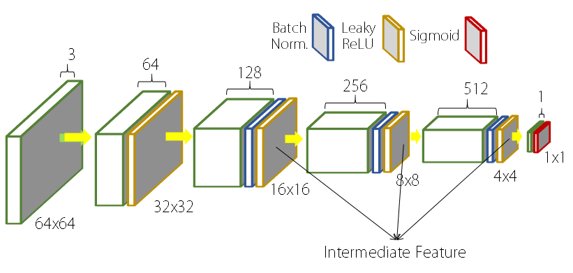
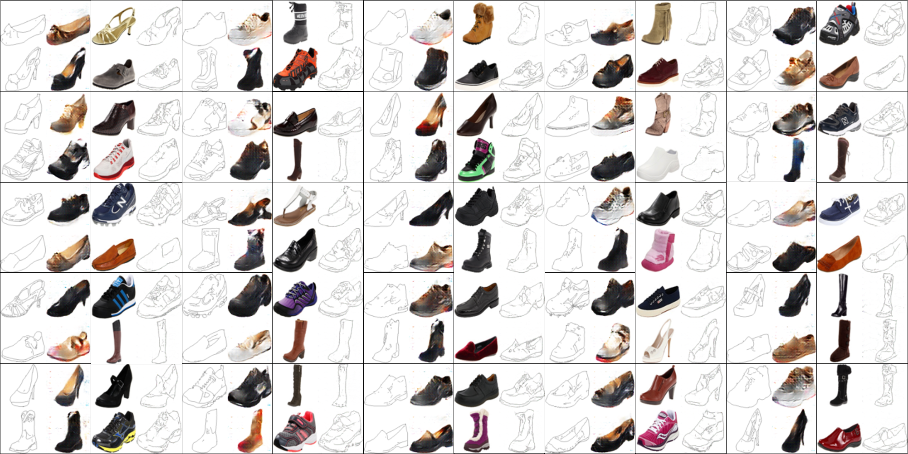
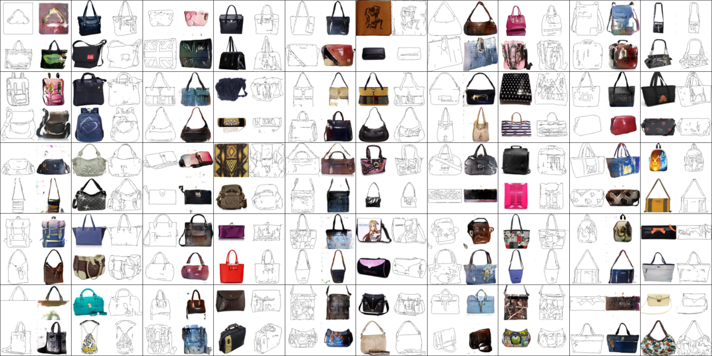
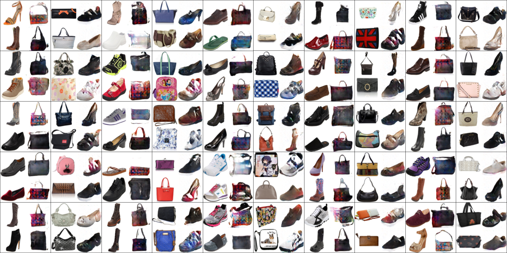

# DiscoGAN in Tensorflow

Study Friendly Implementation of DiscoGAN in Tensorflow

More Information: [Original Paper](https://arxiv.org/pdf/1703.05192.pdf)

Identical Pytorch Implemenation will be uploaded on [taeoh-kim's Github](https://github.com/taeoh-kim/Pytorch_DiscoGAN)

- GAN: [[Pytorch](https://github.com/taeoh-kim/GANin50lines)][[Tensorflow](https://github.com/HyeongminLEE/GANin50lines)]
- DCGAN: [[Pytorch](https://github.com/taeoh-kim/Pytorch_DCGAN)][[Tensorflow](https://github.com/HyeongminLEE/Tensorflow_DCGAN)]
- InfoGAN: [[Pytorch](https://github.com/taeoh-kim/Pytorch_Pix2Pix)][Tensorflow]
- Pix2Pix: [[Pytorch](https://github.com/taeoh-kim/Pytorch_Pix2Pix)][[Tensorflow](https://github.com/HyeongminLEE/Tensorflow_Pix2Pix)]
- DiscoGAN: [[Pytorch](https://github.com/taeoh-kim/Pytorch_DiscoGAN)][[Tensorflow](https://github.com/HyeongminLEE/Tensorflow_DiscoGAN)]

## 1. Environments

- Windows 10 / Linux Ubuntu 16.04.3 (both available)
- Python 3.5.4 (Anaconda)
- Tensorflow 1.4.1
- Numpy 1.13.3

## 2. Code Description

- `train.py`: Main Code
- `test.py`: Test Code after Training
- `model.py`: Generator and Discriminator
- `dbread.py`: My Own Code for Reading Database

## 3. Networks and Parameters

### 3.1 Hyper-Parameters

- Image Size = 64x64 (Resized)
- Batch Size = 64
- Learning Rate = 0.0002
- Adam_beta1 = 0.5

### 3.2 Generator Networks (network.py)

<p align="center"></p>

Image ref: [taeoh-kim's Github](https://github.com/taeoh-kim/Pytorch_DiscoGAN)

### 3.3 Discriminator Networks (network.py)

<p align="center"></p>

Image ref: [taeoh-kim's Github](https://github.com/taeoh-kim/Pytorch_DiscoGAN)

## 4. Database

### 4.1 DB Download
We will split the Pix2Pix database and use them.

- facades: `python database/download-dataset.py facades`
- cityscapes: `python database/download-dataset.py cityscapes`
- maps: `python database/download-dataset.py maps`
- edges2shoes: `python database/download-dataset.py edges2shoes`
- edges2handbags: `python database/download-dataset.py edges2handbags`

`download-dataset.py` is from [this github link](https://github.com/affinelayer/pix2pix-tensorflow)

Or, you can simply download all database from [this link](https://people.eecs.berkeley.edu/~tinghuiz/projects/pix2pix/datasets/)

### 4.2 DB Setting
You can cut each paired data into two unpaired data to run discogan with following command.

```bash
python database/split_db.py --input paired_database_dir --output output_dir
```


## 5. Train

```bash
python train.py
```

- `--train_A`: Directory of the first train database (without last '/')
- `--train_B`: Directory of the second train database (without last '/')
- `--out_dir`: Directory to Save your Train Result
- `--epochs`: Num of Epochs You Want
- `--batch_size`: Batch Size You Want

After finish training, saved models are in the `./output_dir/checkpoint` directory and the Train Results are saved in `./output_dir/result`.

## 6. Test

```bash
python test.py
```

- `--test`: Directory of the test database
- `--out_dir`: Directory to save your test result
- `--ckpt_dir`: Directory of Trained Model(ex: `./out_dir/checkpoint`)
- `--visnum`: Number of visualization per one image file
- `--direction`: 'AtoB' or 'BtoA'
- `--img_num`: The number of images you want to get in test phase.

Test results will be saved in `./out_dir`.


## 7. Results

### [Input A | Output B]

### Edges & Shoes (25 Epochs)

<p align="center"></p>


### Edge & Handbags (25 Epochs)

<p align="center"></p>


### Shoes & Handbags (25 Epochs)

<p align="center"></p>


